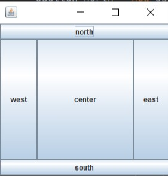
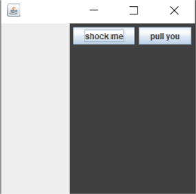
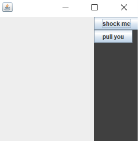
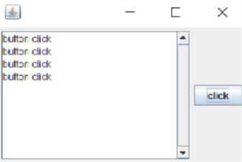

# Head First Java
1. Chapter1
2. Chapter2
3. Chapter3
4. Chapter4
5. Chapter5
6. Chapter6
7. Chapter7
8. Chapter8
9. Chapter9
10. Chapter10
11. Chapter11
12. Chapter12
13. [Chapter13 运用Swing](#chapter13-运用swing)
14. Chapter14
15. Chapter15
## Chapter13 运用Swing


### 1.布局管理器——Layout Manager

布局管理器是个与特定组件相关联的Java对象，可以将被关联的对象看作一个面板，这个面板上加载有一些组件，而布局管理器控制着这些组件的位置与大小。按钮没有布局管理器。

>Swing组件(component)就是会被放在GUI(框架或者面板）上的东西，有Text Field、button、scrollable list、radio button等。所有的组件都继承自java.swing.JComponent。组件分为交互组件和背景组件，但是背景组件也可用于交互，二者的区分不是十分明显。  
组件是可以嵌套的。

### 2.三种布局管理器

不同的布局管理器有不同的组件安置策略（例如对齐网格线、大小一致、垂直堆放等）。有些布局管理器会采用组件的大小设置等信息，但是有些会忽略这些信息。

下面是常用的三种布局管理器：

#### 2.1 BoderLayout
这个管理器会把背景组件分割成5个区域（东南西北中）。每个区域只能放一个组件，该布局管理器通常不会让组件取得默认大小。这是框架（Frame）默认的布局管理器。
>放置在BorderLayout关联的背景组件的东西区域的组件的高度会强制限制成该管理器关联的背景组件高度，宽度不得超过背景组件宽度，超过则被限制为固定值。；放置在南北区域的组件的宽度会限制为背景组件的宽度，高度不得超过背景组件高度，超过则被限制为固定值。

* 使用示例

```java
package chap13;
import javax.swing.*;
import java.awt.*;//BorderLayout布局管理器所在的包

public class BorderlayoutExample {
    public static void main (String [] args){
        BorderlayoutExample gui = new BorderlayoutExample();
        gui.go();
    }

    public void go(){
        JFrame frame = new JFrame();

        JButton east = new JButton("east");
        JButton west = new JButton("west");
        JButton north = new JButton("north");
        JButton south = new JButton("south");
        JButton center = new JButton("center");

        frame.getContentPane().add(BorderLayout.EAST,east);
        frame.getContentPane().add(BorderLayout.WEST,west);
        frame.getContentPane().add(BorderLayout.NORTH,north);
        frame.getContentPane().add(BorderLayout.SOUTH,south);
        frame.getContentPane().add(BorderLayout.CENTER,center);

        frame.setSize(300,300);
        frame.setVisible(true);
    }

}
```

| 结果 |
| :----:  |
||

>占位时东西会取得预设的宽度，南北会取得预设的高度；  
南北会先占位，所以东西的高度还需要扣除南北的高度；  
中央的组件大小要看扣除周围之后还剩下什么；

#### 2.2 FlowLayout

这个管理器的行为和文书排版配置方式类似，。每个组件会依照组件自身预定的大小呈现，从左到右，从上到下依次加入，当前一行放不下时会自动放到下一行。这是面板JPaneld的默认布局管理器。

* 使用示例

```java
import javax.swing.*;
import java.awt.*;//FlowLayout布局管理器所在的包

public class FlowLayoutExample {
    public static void main(String [] args){
        FlowLayoutExample gui = new FlowLayoutExample();
        gui.go();
    }
    void go(){
        JFrame frame = new JFrame();
        frame.setDefaultCloseOperation(JFrame.EXIT_ON_CLOSE);
        JPanel panel = new JPanel();

        JButton button1 = new JButton("shock me");
        JButton button2 = new JButton("pull you");
        panel.add(button1);
        panel.add(button2);

        panel.setBackground(Color.darkGray);
        frame.getContentPane().add(BorderLayout.EAST,panel);
        //这里将面板布局到了框架上，所以面板首先要满足框架
        //的布局管理器要求；
        frame.setSize(300,300);
        frame.setVisible(true);
    }
}
```

| 结果 |
| :----:  |
||

#### 2.3 BoxLayout
这个布局管理器会让每个组件使用各个组件默认的大小，并且按照加入的顺序来排列。通常是以垂直的方向排列，但是也可设置为水平排列方式。

* 使用示例

```java
import javax.swing.*;
import java.awt.*;//BoxLayout布局管理器所在的包

public class BoxLayoutExample {
    public static void main(String [] args){
        BoxLayoutExample gui = new BoxLayoutExample();
        gui.go();
    }
    void go(){
        JFrame frame = new JFrame();
        frame.setDefaultCloseOperation(JFrame.EXIT_ON_CLOSE);
        JPanel panel = new JPanel();
        panel.setLayout(new BoxLayout(panel,BoxLayout.Y_AXIS));
        //改变面板的布局管理器
        JButton buttons = new JButton("shock me");
        JButton button2 = new JButton("pull you");
        panel.add(buttons);
        panel.add(button2);

        panel.setBackground(Color.darkGray);
        frame.getContentPane().add(BorderLayout.EAST,panel);
        frame.setSize(300,300);
        frame.setVisible(true);
    }
}
```

| 结果 |
|:----:|
||

### 3. 几个零散知识点

* 框架JFrame不能像面板一样直接加上组件，因为它是让事物显示在画面上的接点，不是纯Jvav层。可以用自定义的Jpanel来换掉框架的面板。

        myFrame.setContentPane(myPanel);

+ 布局管理器不会考虑组件setSize()方法；因为它会调用组件的getPreferredSize()方法，而这个方法会覆盖对setSize()的调用，

+ 可以使用setLayout(null)直接设定画面位置和大小。但是我们通常使用布局管理器的方式。

+ pack()方法会使得window的大小符合内含组件的大小。

        frame.pack();
        frame.setSize(frame.getPreferredSize());
        //二者效果相同

+ 可以调用setLayout()来改变`面板`的布局管理器

### 4. Swing组件

#### 单行输入组件——JTextField
使用示例：
```java
import javax.swing.*;
import java.awt.*;
import java.awt.event.*;

public class JTextFieldExample implements ActionListener {
    JTextField field = new JTextField(20);
    //这里的20是字长，还可以设置初始字段；
    //JTextField field1 = new JTextField("默认值");
    //JTextField field2 = new JTextField("默认值",20);

    public static void main(String[] args){
        JTextFieldExample gui = new JTextFieldExample();
        gui.go();
    }

    public void go(){
        JFrame frame = new JFrame();
        JPanel panel = new JPanel();

        JButton button = new JButton("click");
        button.addActionListener(this);


        frame.getContentPane().add(BorderLayout.CENTER,panel);
        panel.add(field);
        panel.add(button);
        frame.pack();
        frame.setDefaultCloseOperation(JFrame.EXIT_ON_CLOSE);
        frame.setVisible(true);


    }


    public void actionPerformed(ActionEvent e) {
        System.out.println(field.getText());
        //getField()方法可以获取当前输入框中的文本；
        field.setText("YOU success!");
        //还可以通过setField()方法设置文本；
        System.out.println(field.getText());
    }
}
```
| 结果 |
|:----:|
||

另外，还有其他一些方法：  
1、选取文本字段内容  

    field.selectAll();
2、把GUI目前焦点拉回到文本字段以便让用户进行输入操作

    field.requestFouces();

#### 多行文本输入组件——JTextArea
JTextArea可以有超过一行以上的文字，通常将其粘在滚动条组件ScrollPane上。

范例
```java
import javax.swing.*;
import java.awt.*;
import java.awt.event.*;

public class JTextAreaExample implements ActionListener {
    JTextArea textArea;

    public static void main(String[] args){
        JTextAreaExample gui = new JTextAreaExample();
        gui.go();
    }
    public void go() {
        JFrame frame = new JFrame();
        JPanel panel = new JPanel();

        JButton button = new JButton("click");
        button.addActionListener(this);

        textArea = new JTextArea(10, 20);
        //预设行高和每行字宽：10行20字宽
        textArea.setLineWrap(true);
        //设置自动换行
        JScrollPane scrollPane = new JScrollPane(textArea);
        //将textArea粘到滚动条上
        scrollPane.setHorizontalScrollBarPolicy(ScrollPaneConstants.HORIZONTAL_SCROLLBAR_NEVER);
        scrollPane.setVerticalScrollBarPolicy(ScrollPaneConstants.VERTICAL_SCROLLBAR_ALWAYS);
        //设置只使用垂直滚动条

        panel.add(scrollPane);
        panel.add(button);
        frame.getContentPane().add(BorderLayout.CENTER, panel);
        frame.setDefaultCloseOperation(JFrame.EXIT_ON_CLOSE);
        frame.pack();
        frame.setVisible(true);
    }

    @Override
    public void actionPerformed(ActionEvent e) {
        textArea.append("button click \n");
        //通过append()方法可以加入文字；
        //textArea.setText("替换掉所有文字");
        //也可以直接通过setText()方法直接替换掉所有文字
        //selectAll()方法可以选取内容
        //requestFocus()可以把GUI焦点拉回到文本字段
    }
}
```
| 结果 |
|:----:|
||

#### 复选框
+ 构造函数

        JCheckBox check = new JCheckBox(" Goes to 11");
+ 监听item事件(被选取或者变成非选取)

        check.addItemListener(this);
+ 处理事件(判断是否被选取)
```java
public void itemStateChangeed(ItemEvent ev){
    String oneOroff = "off";
    if (check.isSelected()) onOroff = "on";
    //选取时isSelected()方法返回值为true
    System.out.println("Check box is"+ oneOroff);
}
```
+ 用程序设定来选取或不选取  

        check.setSelected(true);
        check.setSelected(false);

#### 列表组件——JList
+ 构造函数
>Jlist的构造函数需要一个任意类型的数组，不一定要String类型的，但是会显示成String；

    JList list = new JList(listEntire);
+ 通常粘在滚动条上
```java
JScrollPane scrollPane = new JScrollPane(list);
//将list粘到滚动条上
scrollPane.setHorizontalScrollBarPolicy(ScrollPaneConstants.HORIZONTAL_SCROLLBAR_NEVER);
scrollPane.setVerticalScrollBarPolicy(ScrollPaneConstants.VERTICAL_SCROLLBAR_ALWAYS);
 //设置只使用垂直滚动条
panel.add(scrollPane);
```
+ 设定显示的行数

        list.setVisibleRowCount(4);
+ 限制用户只能选取一个项目

        list.setSelectionMode(ListSelectionModel.SINGLE_SELECTION);
+ 对选择时间做注册

        list.addListSelectionListener(this);
+ 处理事件(判断选了哪个项目)
```java
public void valueChanged(ListSelectionEvent lse){
    //如果不加上这个if测试，会得到两次的事件
        if (!lse.getValueIsAdjusting()){
            String selection = (String) list.getSelectedValue();
            //getSelectedValue()会返回一个Object，
            //但是这个Object不一定是个String，所以
            //需要强制转化类型
            System.out.println(selection);
        }
    }
```
### [综合程序示例](../code/HeadFirstJava/BeatBox.java)